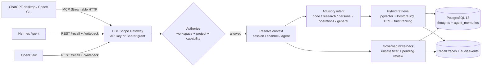

# OB1 Agent Memory scopes on OCI

OB1 keeps one durable memory corpus while making the retrieval decision from
request context. The API is runtime-neutral: OpenClaw, Hermes, Codex CLI, and
ChatGPT desktop can use the same contract. A harness may provide hints, but the
server owns authorization, filtering, provenance, and auditability.



## Scope dimensions

| Dimension | Purpose | Security role |
| --- | --- | --- |
| `workspace_id` | Tenant or knowledge space | Hard authorization boundary |
| `project_id` | Repository, product, or research effort | Hard filter when supplied; a request without a project does not see project-specific records by default |
| `session_id` | Long conversation or task continuity | Context and intent continuity; never an authorization grant |
| `channel` | Chat, CLI, issue, or thread identity | Makes channel memory visible only to the same channel/thread |
| `agent_id` | Harness or logical agent identity | Owns personal memory for non-admin grants |
| `client_surface` | `codex`, `chatgpt`, `hermes`, `openclaw`, dashboard, etc. | Provenance and audit metadata |
| `visibility` | `personal`, `channel`, `project`, `workspace`, `organization` | Hard retrieval policy, limited by the grant |
| intent | `code`, `research`, `personal`, `operations`, `general` | Ranking/session hint only; never authorization |

The effective default is:

```text
current session/channel > current project > workspace
```

When no project is supplied, project-specific memories are excluded. When a
request is ambiguous, the server can use the prior session domain or ask the
configured inference provider to classify the request. The classifier receives
redacted, bounded text and its result is stored as metadata—not as an
instruction.

## Grant configuration

`OB1_BRAIN_KEY` remains a compatibility administrator credential. For normal
harnesses, add least-privilege grants to `/etc/ob1/ob1.env`:

```dotenv
OB1_DEFAULT_WORKSPACE_ID=default
OB1_SCOPE_GRANTS_JSON=[{"id":"codex","secret":"replace-with-a-long-random-value","principal_id":"codex","default_workspace_id":"default","allowed_workspaces":["default"],"allowed_projects":["ob1"],"allowed_visibility":["personal","channel","project","workspace"],"capabilities":["recall","writeback"],"default_scope_mode":"auto","allow_unconfirmed":false,"include_legacy_thoughts":false},{"id":"hermes","secret":"replace-with-another-long-random-value","principal_id":"hermes","default_workspace_id":"default","allowed_workspaces":["default"],"allowed_projects":["*"],"allowed_visibility":["personal","channel","project","workspace"],"capabilities":["recall","writeback"],"default_scope_mode":"personal","allow_unconfirmed":false,"include_legacy_thoughts":false}]
```

The JSON is intentionally a single environment variable so secrets do not
enter the repository. Generate each secret independently and keep the file
mode `0600`. A grant without `review` cannot promote generated memory to
instruction-grade memory. The compatibility administrator can review the
queue from the dashboard or the review API.

## API and MCP setup

The service accepts both `x-brain-key` and `Authorization: Bearer ...`. The
scoped REST base is `/agent-memory`; root aliases preserve compatibility with
the existing OpenClaw and Hermes clients.

### Codex CLI and desktop

Set a local environment variable containing a grant secret, then add the
Streamable HTTP MCP server to the shared Codex configuration:

```bash
export OB1_BRAIN_KEY='the-grant-secret'
codex mcp add ob1-agent-memory \
  --url http://<tailscale-host>:8787/agent-memory/mcp \
  --bearer-token-env-var OB1_BRAIN_KEY
```

The same MCP configuration is used by ChatGPT desktop, Codex CLI, and the IDE
extension. For a project-only configuration, put the equivalent server entry
in the repository's `.codex/config.toml`. The MCP façade intentionally exposes
three small tools:

- `search`: scoped hybrid recall;
- `fetch`: authorized memory inspection;
- `remember`: compact, reviewable write-back.

For ChatGPT desktop, add the same Streamable HTTP URL under Settings → MCP
servers. A private Tailscale/ZeroTier address is reachable by a local desktop
client, but not by a hosted cloud connector. A hosted connector needs a stable
HTTPS endpoint and an OAuth or bearer-auth front door; do not expose PostgreSQL.

### Hermes

Point `OPENBRAIN_URL` or `$HERMES_HOME/ob1.json` at the scoped REST base:

```bash
export OPENBRAIN_URL='http://<tailscale-host>:8787/agent-memory'
export OPENBRAIN_KEY='the-hermes-grant-secret'
export OPENBRAIN_WORKSPACE_ID='default'
export OPENBRAIN_PROJECT_ID='ob1'          # optional
```

Hermes sends its session ID, agent identity, runtime, and channel metadata.
Its auto-capture remains compact and generated write-backs remain pending
review.

### OpenClaw

Configure the plugin endpoint as either
`http://<tailscale-host>:8787/agent-memory` or the API root, with the matching
grant secret:

```json
{
  "endpoint": "http://<tailscale-host>:8787/agent-memory",
  "accessKey": "the-openclaw-grant-secret",
  "workspaceId": "default",
  "projectId": "ob1",
  "agentId": "openclaw-code",
  "clientSurface": "openclaw"
}
```

The plugin can override `session_id`, `agent_id`, `client_surface`, and
`intent_hint` per call. These fields improve continuity and ranking without
letting the model bypass grant policy.

## Operational endpoints

```text
POST  /agent-memory/recall
POST  /agent-memory/writeback
POST  /agent-memory/recall/:request_id/usage
GET   /agent-memory/memories/review
GET   /agent-memory/memories/:id
PATCH /agent-memory/memories/:id/review
GET   /agent-memory/recall-traces/:request_id
POST  /agent-memory/mcp
```

Apply `migrations/002_agent_memory_scope.sql` with the normal OCI migration
command. It creates session, sidecar, review, trace, and audit tables and
imports existing `thoughts` into the `default` workspace as imported evidence.
The embedding contract remains `text-embedding-3-large`, 3072 dimensions,
`halfvec(3072)`, cosine distance; no re-indexing model change is implied.

This implementation follows Nate B. Jones’ OB1 continuity model: durable
memory stays owned by the operator, while each harness contributes useful,
reviewable context. Practical OB1 systems and further working notes are
available from [Nate’s newsletter](https://substack.com/@natesnewsletter) and
[natebjones.com](https://natebjones.com).

